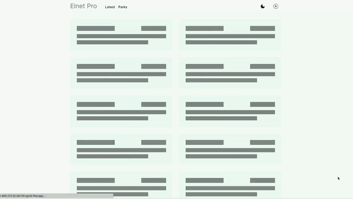
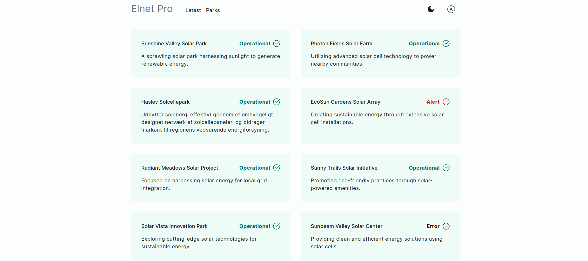
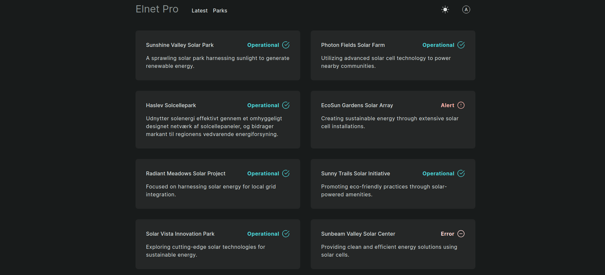
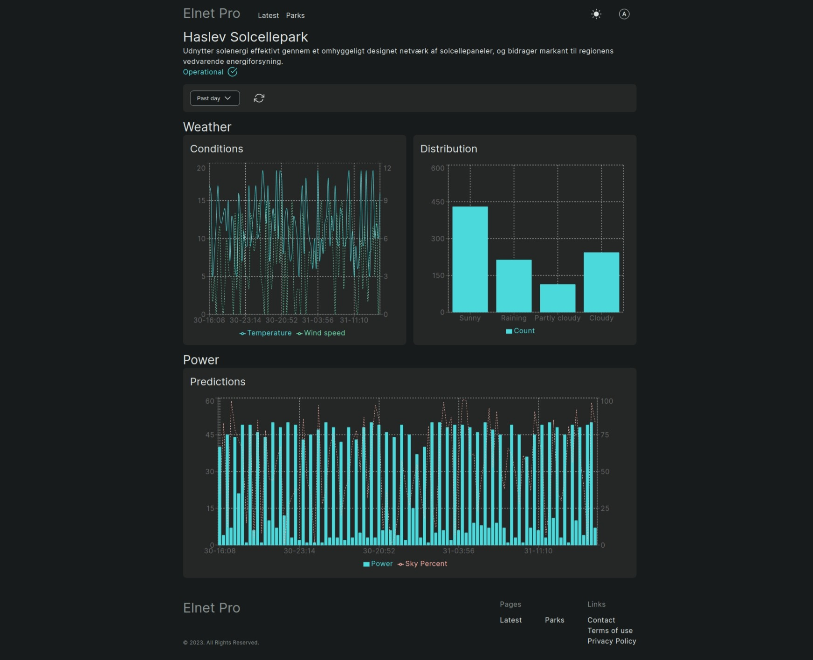
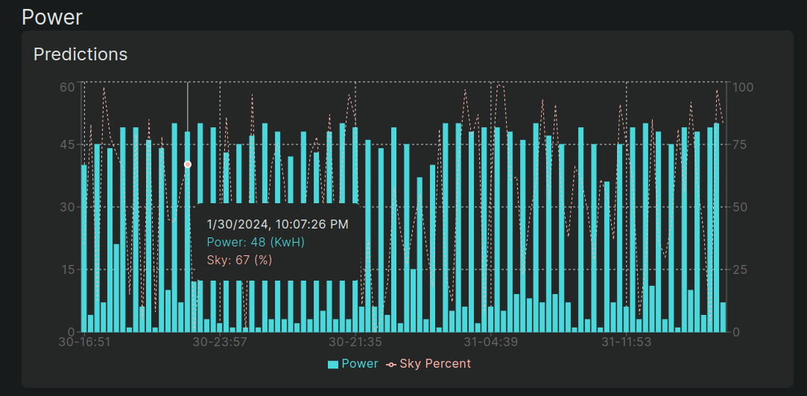
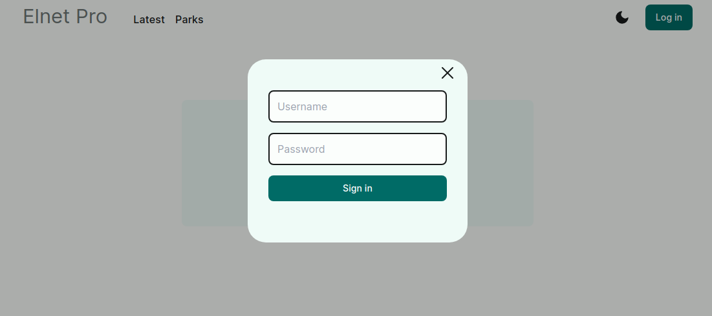
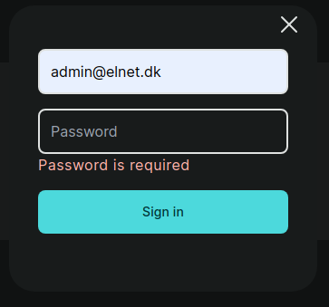
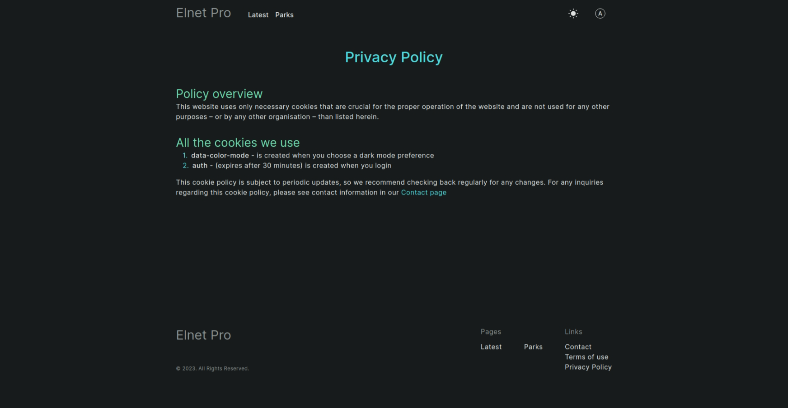
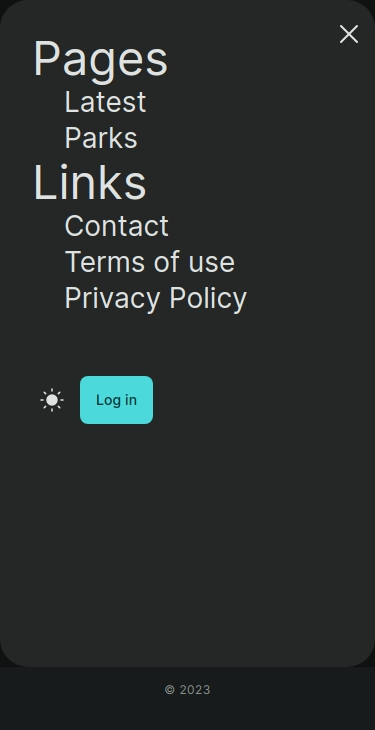

# Elnet Pro

Elnet Pro is a sophisticated data analysis platform designed specifically for solar parks within a solar grid. This platform excels in visualizing crucial metrics, providing insightful data on energy production and consumption. One of its key features is its predictive capability, allowing users to anticipate the energy needs at specific data points based on environmental conditions, particularly cloud cover. This predictive functionality enhances the efficiency of solar energy management by offering valuable insights into energy requirements under varying conditions.

## Screenshots

Loading:



Home page:




Park view:




Login:





Privacy



Mobile navigation



## Getting Started

First, run the development server:

```bash
next dev --experimental-https
# or
yarn dev
# or
pnpm dev
# or
bun dev
```

Open [http://localhost:3000](http://localhost:3000) with your browser to see the result.

You can start editing the page by modifying `app/page.tsx`. The page auto-updates as you edit the file.

## Thank you

| Jetbrains                                                                                                                                                                                                               |
|-------------------------------------------------------------------------------------------------------------------------------------------------------------------------------------------------------------------------|
| [][jetbrains] |
| Product subscriptions provided by JetBrains                                                                                                                                                                             |

[jetbrains]: https://jb.gg/OpenSourceSupport